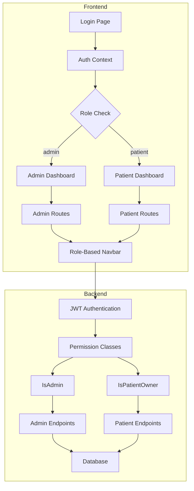
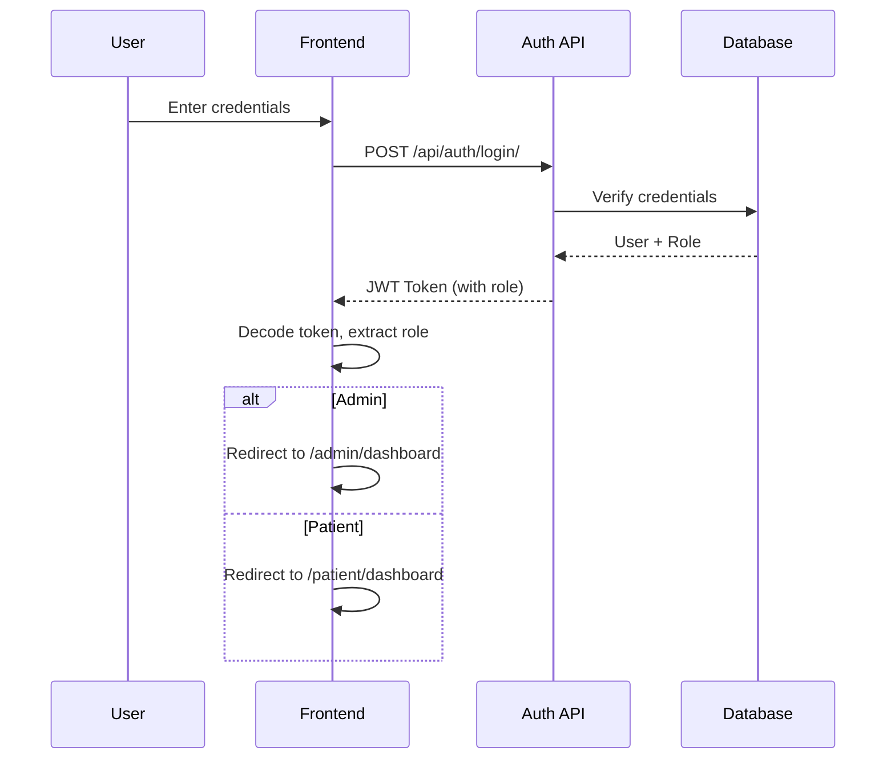
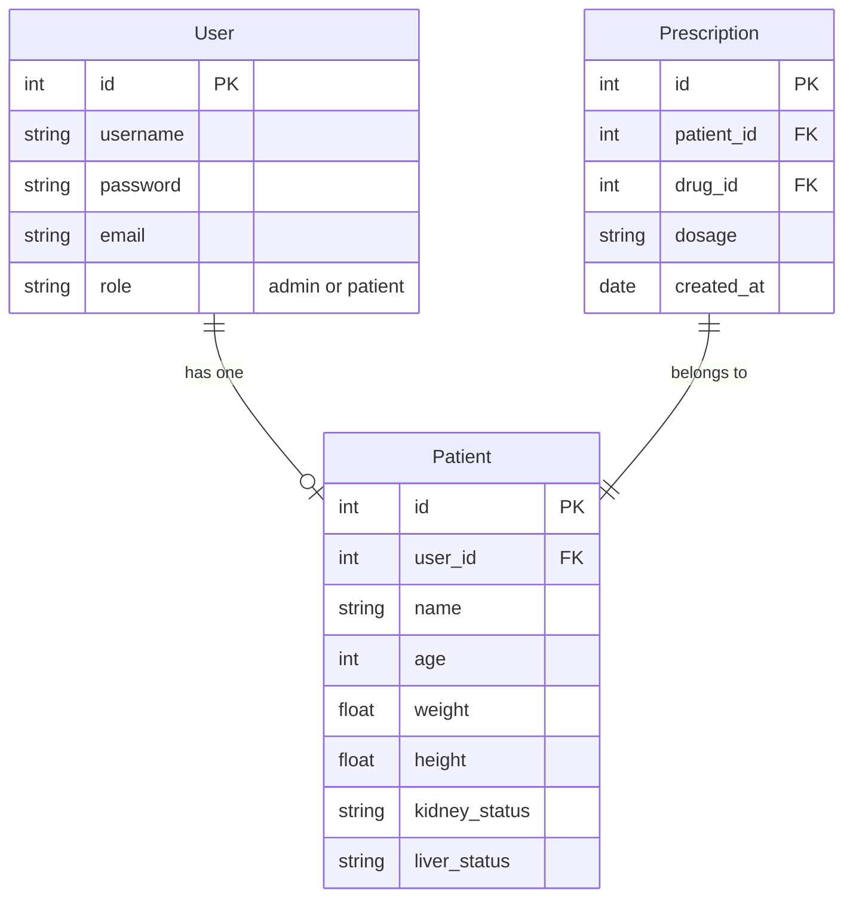

# Design Document: Role-Based Access Control (RBAC)

## Overview

This design document specifies the implementation of Role-Based Access Control (RBAC) for the OncoSafe oncology prescription safety system. The feature adds two user roles (Admin and Patient) with appropriate access controls, role-specific dashboards, and data isolation to ensure privacy and regulatory compliance.

### Simplified Scope

This implementation follows a simplified approach focusing on core RBAC functionality:

**Backend:**
- Extend Django User model with role field (admin/patient)
- Customize JWT serializer to include role in token payload
- Create permission classes: IsAdmin and IsPatientOwner
- Add patient-specific endpoints: /api/my/profile/, /api/my/prescriptions/
- Link Patient model to User via OneToOneField

**Frontend:**
- Role-based login redirect (admin → /admin/dashboard, patient → /patient/dashboard)
- Role-based navbar component
- Admin routes: dashboard, patients, drugs, inventory, prescription, dose
- Patient routes: dashboard, prescriptions, profile
- Route protection to prevent cross-role access

**Out of Scope:**
- Logging/audit trails
- Password reset functionality
- Account deactivation
- Notification badges
- Toxicity alerts
- Dose history tracking
- Export features

## Architecture

### System Components



### Authentication Flow



## Components and Interfaces

### Backend Components

#### 1. User Model Extension

Extend Django's built-in User model to include role information:

```python
# backend/apps/patients/models.py
from django.contrib.auth.models import User
from django.db import models

# Add role field to User model via migration
# User.add_to_class('role', models.CharField(
#     max_length=10, 
#     choices=[('admin', 'Admin'), ('patient', 'Patient')],
#     default='patient'
# ))

class Patient(models.Model):
    user = models.OneToOneField(User, on_delete=models.CASCADE, related_name='patient_profile')
    name = models.CharField(max_length=200)
    age = models.IntegerField()
    weight = models.FloatField()  # kg
    height = models.FloatField()  # cm
    kidney_status = models.CharField(max_length=50)
    liver_status = models.CharField(max_length=50)
```

#### 2. Custom JWT Serializer

```python
# backend/oncosafe/serializers.py
from rest_framework_simplejwt.serializers import TokenObtainPairSerializer

class CustomTokenObtainPairSerializer(TokenObtainPairSerializer):
    @classmethod
    def get_token(cls, user):
        token = super().get_token(user)
        token['role'] = getattr(user, 'role', 'patient')
        return token
    
    def validate(self, attrs):
        data = super().validate(attrs)
        data['role'] = getattr(self.user, 'role', 'patient')
        return data
```

#### 3. Permission Classes

```python
# backend/oncosafe/permissions.py
from rest_framework.permissions import BasePermission

class IsAdmin(BasePermission):
    def has_permission(self, request, view):
        return request.user and request.user.is_authenticated and getattr(request.user, 'role', None) == 'admin'

class IsPatientOwner(BasePermission):
    def has_permission(self, request, view):
        return request.user and request.user.is_authenticated and getattr(request.user, 'role', None) == 'patient'
    
    def has_object_permission(self, request, view, obj):
        # Verify the patient profile belongs to the authenticated user
        if hasattr(obj, 'user'):
            return obj.user == request.user
        return False
```

#### 4. API Endpoints

**Authentication Endpoints:**
- `POST /api/auth/login/` - Login with username/password, returns JWT with role
- `POST /api/auth/register/` - Register new patient account
- `GET /api/auth/me/` - Get current user info including role

**Admin Endpoints (IsAdmin permission):**
- `GET /api/patients/` - List all patients
- `POST /api/patients/` - Create new patient with user account
- `GET /api/drugs/` - List all drugs
- `POST /api/drugs/` - Add new drug
- `GET /api/inventory/` - List inventory
- `POST /api/inventory/` - Add inventory item
- `GET /api/prescriptions/` - List all prescriptions
- `POST /api/prescriptions/` - Create prescription for any patient

**Patient Endpoints (IsPatientOwner permission):**
- `GET /api/my/profile/` - Get own patient profile
- `GET /api/my/prescriptions/` - Get own prescriptions only

### Frontend Components

#### 1. Enhanced Auth Context

```javascript
// frontend/src/context/AuthContext.jsx
const AuthContext = createContext(null)

export const AuthProvider = ({ children }) => {
  const [user, setUser] = useState(null)
  const [role, setRole] = useState(null)
  const [isAuthenticated, setIsAuthenticated] = useState(false)
  
  const login = (token) => {
    localStorage.setItem('token', token)
    const payload = JSON.parse(atob(token.split('.')[1]))
    setUser(payload)
    setRole(payload.role)
    setIsAuthenticated(true)
  }
  
  const logout = () => {
    localStorage.removeItem('token')
    setUser(null)
    setRole(null)
    setIsAuthenticated(false)
  }
  
  return (
    <AuthContext.Provider value={{ user, role, isAuthenticated, login, logout }}>
      {children}
    </AuthContext.Provider>
  )
}
```

#### 2. Role-Based Route Protection

```javascript
// frontend/src/components/RoleProtectedRoute.jsx
const RoleProtectedRoute = ({ children, allowedRoles }) => {
  const { role, isAuthenticated } = useAuth()
  const navigate = useNavigate()
  
  useEffect(() => {
    if (!isAuthenticated) {
      navigate('/login')
    } else if (!allowedRoles.includes(role)) {
      navigate(role === 'admin' ? '/admin/dashboard' : '/patient/dashboard')
    }
  }, [role, isAuthenticated])
  
  return isAuthenticated && allowedRoles.includes(role) ? children : null
}
```

#### 3. Role-Based Navbar

```javascript
// frontend/src/components/RoleBasedNavbar.jsx
const RoleBasedNavbar = () => {
  const { role, logout } = useAuth()
  
  if (role === 'admin') {
    return (
      <nav>
        <Link to="/admin/dashboard">Dashboard</Link>
        <Link to="/admin/patients">Patients</Link>
        <Link to="/admin/drugs">Drugs</Link>
        <Link to="/admin/inventory">Inventory</Link>
        <Link to="/admin/prescription">Prescription</Link>
        <Link to="/admin/dose">Dose Calculator</Link>
        <button onClick={logout}>Logout</button>
      </nav>
    )
  }
  
  return (
    <nav>
      <Link to="/patient/dashboard">My Dashboard</Link>
      <Link to="/patient/prescriptions">My Prescriptions</Link>
      <Link to="/patient/profile">My Profile</Link>
      <button onClick={logout}>Logout</button>
    </nav>
  )
}
```

## Data Models

### Database Schema Changes



### Migration Strategy

1. **Migration 1**: Add `role` field to User model
   ```python
   from django.db import migrations, models
   
   class Migration(migrations.Migration):
       dependencies = [('auth', '__latest__')]
       
       operations = [
           migrations.AddField(
               model_name='user',
               name='role',
               field=models.CharField(
                   max_length=10,
                   choices=[('admin', 'Admin'), ('patient', 'Patient')],
                   default='patient'
               ),
           ),
       ]
   ```

2. **Migration 2**: Add `user` OneToOneField to Patient model
   ```python
   class Migration(migrations.Migration):
       dependencies = [('patients', '0001_initial')]
       
       operations = [
           migrations.AddField(
               model_name='patient',
               name='user',
               field=models.OneToOneField(
                   'auth.User',
                   on_delete=models.CASCADE,
                   related_name='patient_profile',
                   null=True
               ),
           ),
       ]
   ```

3. **Data Migration**: Create User accounts for existing patients (if any)

## Error Handling

### Backend Error Responses

**Authentication Errors:**
- `401 Unauthorized` - Invalid credentials or missing token
- `403 Forbidden` - Valid token but insufficient permissions

**Validation Errors:**
- `400 Bad Request` - Invalid input data with field-specific error messages

**Example Error Response:**
```json
{
  "error": "Permission denied",
  "detail": "You do not have permission to access this resource",
  "code": "permission_denied"
}
```

### Frontend Error Handling

**Token Expiration:**
- Detect 401 responses
- Clear local storage
- Redirect to login page
- Show "Session expired" message

**Permission Denied:**
- Detect 403 responses
- Redirect to appropriate dashboard
- Show "Access denied" message

**Network Errors:**
- Show user-friendly error messages
- Provide retry mechanism
- Log errors for debugging

## Testing Strategy

### Backend Testing

#### Unit Tests

**Permission Class Tests:**
```python
# backend/tests/test_permissions.py
class TestIsAdminPermission(TestCase):
    def test_admin_user_has_permission(self):
        user = User.objects.create_user(username='admin', password='pass', role='admin')
        request = self.factory.get('/')
        request.user = user
        permission = IsAdmin()
        self.assertTrue(permission.has_permission(request, None))
    
    def test_patient_user_denied_permission(self):
        user = User.objects.create_user(username='patient', password='pass', role='patient')
        request = self.factory.get('/')
        request.user = user
        permission = IsAdmin()
        self.assertFalse(permission.has_permission(request, None))
```

**JWT Serializer Tests:**
```python
# backend/tests/test_serializers.py
class TestCustomTokenSerializer(TestCase):
    def test_token_includes_role(self):
        user = User.objects.create_user(username='test', password='pass', role='admin')
        token = CustomTokenObtainPairSerializer.get_token(user)
        self.assertEqual(token['role'], 'admin')
```

**API Endpoint Tests:**
```python
# backend/tests/test_api.py
class TestPatientEndpoints(APITestCase):
    def test_patient_can_access_own_profile(self):
        user = User.objects.create_user(username='patient1', password='pass', role='patient')
        patient = Patient.objects.create(user=user, name='John Doe', age=30, weight=70, height=175, kidney_status='Normal', liver_status='Normal')
        self.client.force_authenticate(user=user)
        response = self.client.get('/api/my/profile/')
        self.assertEqual(response.status_code, 200)
        self.assertEqual(response.data['name'], 'John Doe')
    
    def test_patient_cannot_access_admin_endpoints(self):
        user = User.objects.create_user(username='patient1', password='pass', role='patient')
        self.client.force_authenticate(user=user)
        response = self.client.get('/api/patients/')
        self.assertEqual(response.status_code, 403)
```

#### Integration Tests

- Test complete authentication flow (login → token → access protected resource)
- Test role-based access across multiple endpoints
- Test patient data isolation (patient A cannot access patient B's data)
- Test admin can access all patient data

### Frontend Testing

#### Component Tests

**Auth Context Tests:**
```javascript
// frontend/src/context/__tests__/AuthContext.test.jsx
describe('AuthContext', () => {
  it('extracts role from JWT token', () => {
    const { result } = renderHook(() => useAuth(), { wrapper: AuthProvider })
    const mockToken = 'header.' + btoa(JSON.stringify({ role: 'admin', user_id: 1 })) + '.signature'
    act(() => {
      result.current.login(mockToken)
    })
    expect(result.current.role).toBe('admin')
  })
})
```

**Route Protection Tests:**
```javascript
// frontend/src/components/__tests__/RoleProtectedRoute.test.jsx
describe('RoleProtectedRoute', () => {
  it('redirects patient away from admin routes', () => {
    const mockNavigate = jest.fn()
    jest.mock('react-router-dom', () => ({ useNavigate: () => mockNavigate }))
    render(
      <AuthProvider value={{ role: 'patient', isAuthenticated: true }}>
        <RoleProtectedRoute allowedRoles={['admin']}>
          <div>Admin Content</div>
        </RoleProtectedRoute>
      </AuthProvider>
    )
    expect(mockNavigate).toHaveBeenCalledWith('/patient/dashboard')
  })
})
```

#### End-to-End Tests

- Test admin login → dashboard → patient management flow
- Test patient login → dashboard → view prescriptions flow
- Test unauthorized access attempts
- Test logout and session cleanup

### Test Data (Seed Data)

```python
# backend/management/commands/seed_rbac_data.py
from django.core.management.base import BaseCommand
from django.contrib.auth.models import User
from apps.patients.models import Patient

class Command(BaseCommand):
    def handle(self, *args, **kwargs):
        # Create admin user
        admin = User.objects.create_user(
            username='admin',
            password='admin123',
            role='admin'
        )
        
        # Create patient users
        patient1_user = User.objects.create_user(
            username='patient1',
            password='patient123',
            role='patient'
        )
        Patient.objects.create(
            user=patient1_user,
            name='John Doe',
            age=45,
            weight=75.0,
            height=175.0,
            kidney_status='Normal',
            liver_status='Normal'
        )
        
        patient2_user = User.objects.create_user(
            username='patient2',
            password='patient123',
            role='patient'
        )
        Patient.objects.create(
            user=patient2_user,
            name='Jane Smith',
            age=52,
            weight=65.0,
            height=165.0,
            kidney_status='Low',
            liver_status='Normal'
        )
        
        self.stdout.write(self.style.SUCCESS('Successfully created seed data'))
```

## Implementation Notes

### Security Considerations

1. **Password Storage**: Use Django's built-in password hashing (PBKDF2)
2. **JWT Security**: 
   - Access token lifetime: 5 hours
   - Refresh token lifetime: 1 day
   - Store tokens in localStorage (acceptable for this use case)
3. **Permission Checks**: Always verify permissions on both frontend (UX) and backend (security)
4. **Data Isolation**: Use Django ORM filters to ensure patients only see their own data

### Performance Considerations

1. **Database Queries**: Use `select_related('user')` when querying Patient model
2. **JWT Token Size**: Keep payload minimal (only user_id, username, role)
3. **Frontend Routing**: Use React.lazy() for code splitting by role

### Backward Compatibility

1. **Existing Users**: Data migration will assign 'patient' role to all existing users
2. **Existing API Endpoints**: Maintain current endpoints, add new role-specific endpoints
3. **Frontend**: Existing routes will redirect based on detected role

### Deployment Steps

1. Run database migrations
2. Run seed data command to create admin and test patient accounts
3. Deploy backend with new endpoints
4. Deploy frontend with role-based routing
5. Test admin and patient login flows
6. Verify permission enforcement

## Summary

This design implements a simplified RBAC system for OncoSafe with:

- **Two roles**: Admin (full access) and Patient (restricted access)
- **Backend**: Django User model extension, JWT with role, permission classes, role-specific endpoints
- **Frontend**: Role-based routing, role-specific dashboards, protected routes
- **Security**: Permission checks on backend, data isolation for patients
- **Testing**: Unit tests for permissions, integration tests for flows, E2E tests for user journeys

The implementation follows Django and React best practices, maintains backward compatibility, and provides a foundation for future RBAC enhancements.
